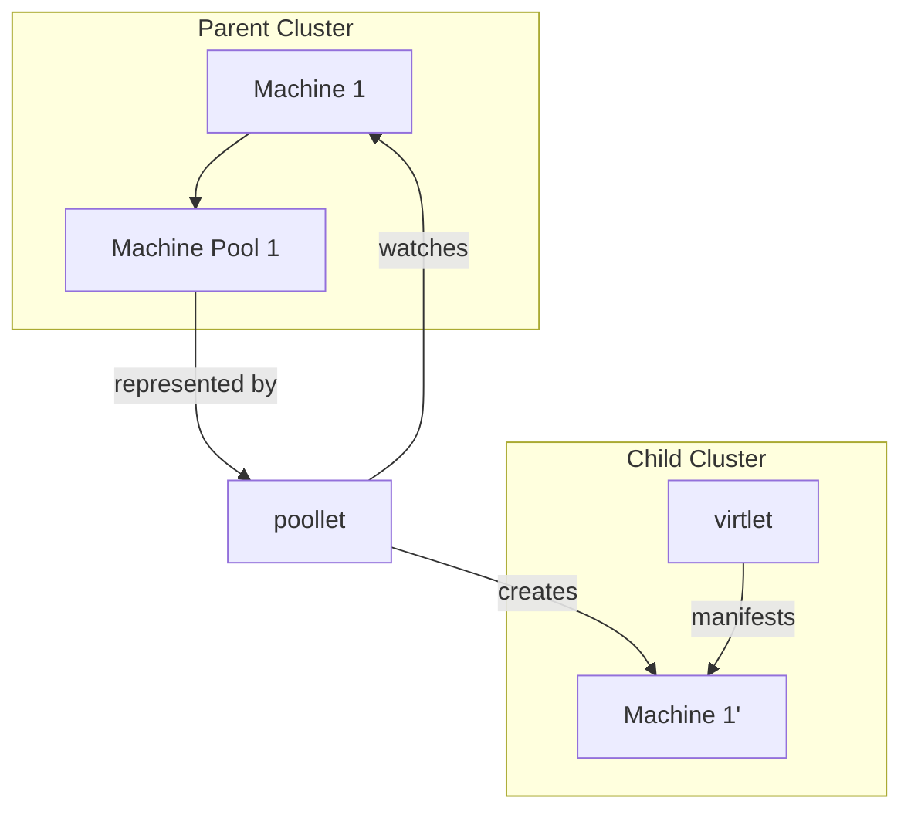

# Architecture

This section covers the core concepts of the `onmetal-api-net` project.

## Distributed `onmetal-api` / `poollet` cluster setup.

The `onmetal-api` is designed such that portions of the API objects
in a parent `onmetal-api` cluster can be distributed to child
`onmetal-api` clusters. This distribution and the propagation back
up is achieved using the [`poollet` project](https://github.com/onmetal/poollet).
The distribution hierarchy can contain an arbitrary number of levels.

**Example Setup**

The following setup depicts a rough outline of a setup with a
parent cluster and a single child cluster.

In this setup, the child cluster is responsible for actually manifesting
the `Machine`. The `poollet` proxies the `Machine` of the parent cluster
to the child cluster and makes sure the status updates propagate back up.

For `Machine` types, the flow of control / reconciliation is clear:
Control is from parent to child (top-down), reconciliation / actual implementation
is from child to parent (bottom-up).

However, how should the control / reconciliation flow look like for networking
types that have to be centrally consistent like e.g. `VirtualIP`s that need
a central consistent store for allocation?

This is the problem that `onmetal-api-net` tries to solve by defining types
and controllers that make managing these types in a multi-cluster environment
possible.
